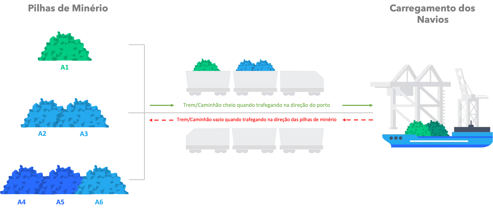

# PyBlend

<div align="center">
  
</div>


## About this project 📑

PyBlend is a proof of concept (POC) optimization model that offers heuristic
solutions and modeling in linear programming for
the [Ore Mixing Problem (OMP)](#ore-mixing-or-blending-problem)
and the [Unrelated Parallel Machine Scheduling Problem (UPMSP)](#unrelated-parallel-machine-scheduling-problem).


### Ore mixing or blending problem ⛰ {#ore-mixing-or-blending-problem}

The ore mixing or blending problem involves determining the quantity of
each ore from a set of piles to form a final product that meets the
customer's specific requirements. As ores have varying characteristics—such
as the content of certain chemical elements or the percentage within
a particular granulometric range—they must be combined in specific proportions
to achieve the desired quality and quantity.


### Unrelated parallel machine scheduling problem 🚜 {#unrelated-parallel-machine-scheduling-problem}

This problem focuses on scheduling a set of jobs, each available at a specific time,
on unrelated machines. The challenge lies in managing the stacking and recovery
of materials from ore stacks, considering that load differences between orders
and the necessity to meet quality standards cause significant variation in the
time and energy required for these operations.

## How to use 💻 

To get started, clone the repository:

```bash
git clone https://github.com/erik-ingwersen-ey/pyblend.git
```

Next, navigate to the cloned repository directory by executing the command 
`cd pyblend` and then install the `pyblend` package and its dependencies using
the command:

```bash
pip install -e .
```

> **Note:** the `-e` flag specifies that the `pyblend` package should be
> installed in development mode. This means that the project source code won't be copied
> to your Python environment `site-packages` directory.

### Running the solver

Follow the instructions below to use the solver:

```bash
Usage: python pyblend <input> <output> [options]
<input>  : Name of the problem JSON input file.
<output> : Name of the (output) solution file.

Options:
    -constructive <constructive> : premodel, postmodel (default: postmodel).
    -algorithm <algorithm>       : lahc, sa.
    -feedback <feedback>         : maximum number of feedback interactions with the model (default: 0).
    -seed <seed>                 : random seed (default: 0).
    -maxiters <maxiters>         : maximum number of iterations (default: 1000).

LAHC parameters:
    -lsize <lsize> : LAHC list size (default: 1000).

SA parameters:
    -alpha <alpha> : Cooling rate for Simulated Annealing (default: 0.9).
    -samax <samax> : Iterations before updating the temperature for Simulated Annealing (default: 1000).
    -t0 <t0>       : Initial temperature for Simulated Annealing (default: 1.0). 
```

### Examples

```bash
python pyblend instance_1.json out_1.json
python pyblend instance_1.json out_1.json
python pyblend instance_1.json out_1.json -constructive premodel -seed 1
python pyblend instance_1.json out_1.json -algorithm sa -alpha 0.98 -samax 1000 -t0 1e5
```

Running the first example from the preceding list generates the following
output JSON file to the [out](./out) directory:

```json
{
  "info": [
    "Instance_001",
    1000,
    1
  ],
  "objective": 8523333.333333371,
  "gap": [
    0.37
  ],
  "stacks": [
    {
      "weight": 80000.0,
      "stockpile": 1,
      "engine": 2,
      "start_time": 7.91,
      "duration": 22.22
    }
  ],
  "reclaims": [
    {
      "weight": 90000.0,
      "stockpile": 2,
      "engine": 1,
      "start_time": 0.06,
      "duration": 69.23,
      "output": 1
    },
    {
      "weight": 10000.0,
      "stockpile": 3,
      "engine": 2,
      "start_time": 0.06,
      "duration": 7.69,
      "output": 1
    },
    {
      "weight": 200000.0,
      "stockpile": 1,
      "engine": 2,
      "start_time": 30.19,
      "duration": 153.85,
      "output": 1
    }
  ],
  "outputs": [
    {
      "weight": 300000,
      "start_time": 0.06,
      "duration": 183.98,
      "quality": [
        {
          "parameter": "Fe",
          "value": 57.0,
          "minimum": 57,
          "maximum": 100,
          "goal": 57,
          "importance": 10
        },
        {
          "parameter": "SiO2",
          "value": 5.34,
          "minimum": 0,
          "maximum": 5.8,
          "goal": 5.8,
          "importance": 1000
        },
        {
          "parameter": "Al2O3",
          "value": 4.61,
          "minimum": 0,
          "maximum": 4.9,
          "goal": 4.9,
          "importance": 100
        },
        {
          "parameter": "P",
          "value": 0.05,
          "minimum": 0,
          "maximum": 0.07,
          "goal": 0.07,
          "importance": 100
        },
        {
          "parameter": "+31.5",
          "value": 7.8,
          "minimum": 0,
          "maximum": 10,
          "goal": 10,
          "importance": 100
        },
        {
          "parameter": "-6.3",
          "value": 19.83,
          "minimum": 0,
          "maximum": 25,
          "goal": 25,
          "importance": 100
        }
      ]
    }
  ]
}
```

The output JSON indicates that the **ore is reclaimed from three stockpiles** 1,
2, and 3 using **engines 1 and 2**. The total weight reclaimed from these 
stockpiles is as follows:

- **Stockpile 1:** 200,000 tons
- **Stockpile 2:** 90,000 tons
- **Stockpile 3:** 10,000 tons

The total reclaimed weight is the sum of the weights reclaimed from each stockpile:

\[ \text{Total Reclaimed Weight} = 90,000 \, \text{(Stockpile 2)} + 10,000 \, \text{(Stockpile 3)} + 200,000 \, \text{(Stockpile 1)} = 300,000 \, \text{tons} \]


The weighted average for each quality parameter is calculated using the formula:

\[
\text{Quality Value} = \frac{ \sum (\text{Weight from Stockpile} \times \text{Quality from Stockpile}) }{ \text{Total Reclaimed Weight} }
\]

Therefore, the quality values were calculated as follows:

1. **Fe (Iron Content)**:
   \[
   \text{Fe} = \frac{(90,000 \times 56.3) + (10,000 \times 57.3) + (200,000 \times 57.3)}{300,000} = \frac{5,067,000 + 573,000 + 11,460,000}{300,000} = \frac{17,100,000}{300,000} = 57.0
   \]

2. **SiO2 (Silicon Dioxide)**:
   \[
   \text{SiO}_{2} = \frac{(90,000 \times 5.6) + (10,000 \times 3.7) + (200,000 \times 5.3)}{300,000} = \frac{504,000 + 37,000 + 1,060,000}{300,000} = \frac{1,601,000}{300,000} \approx 5.34
   \]

3. **Al2O3 (Aluminum Oxide)**:
   \[
   \text{Al}_{2}\text{O}_{3} = \frac{(90,000 \times 4.8) + (10,000 \times 5.0) + (200,000 \times 4.5)}{300,000} = \frac{432,000 + 50,000 + 900,000}{300,000} = \frac{1,382,000}{300,000} \approx 4.61
   \]

4. **P (Phosphorus)**:
   \[
   \text{P} = \frac{(90,000 \times 0.05) + (10,000 \times 0.05) + (200,000 \times 0.05)}{300,000} = \frac{4,500 + 500 + 10,000}{300,000} = \frac{15,000}{300,000} = 0.05
   \]

5. **+31.5 (Percentage of particles greater than 31.5mm)**:
   \[
   \text{+31.5} = \frac{(90,000 \times 8) + (10,000 \times 2) + (200,000 \times 8)}{300,000} = \frac{720,000 + 20,000 + 1,600,000}{300,000} = \frac{2,340,000}{300,000} = 7.8
   \]

6. **-6.3 (Percentage of particles less than 6.3mm)**:
   \[
   \text{-6.3} = \frac{(90,000 \times 20) + (10,000 \times 15) + (200,000 \times 20)}{300,000} = \frac{1,800,000 + 150,000 + 4,000,000}{300,000} = \frac{5,950,000}{300,000} \approx 19.83
   \]

The calculated values for each quality parameter match the values given in the output JSON:

- \[ \text{Fe} \]: 57.0
- \[ \text{SiO}_{2} \]: 5.34
- \[ \text{Al}_{2}\text{O}_{3} \]: 4.61
- \[ \text{P} \]: 0.05
- \[ +31.5 \]: 7.8
- \[ -6.3 \: 19.83

### Input and output files

- **Input files** required to run the solver are available in the [`tests`](./tests) folder.
- **Output files** are generated in the `out` folder, with the results located in the `json`
  subfolder and an LP file with the generated model in the `logs` subfolder.

## License 📕

This software is available under the [MIT License](./LICENSE).
